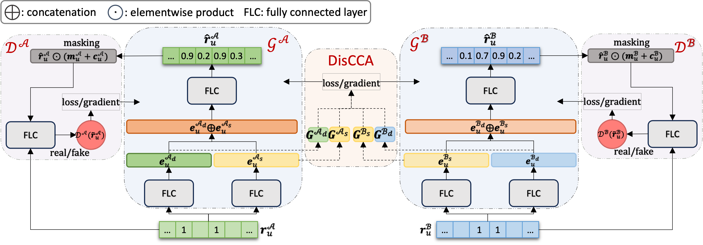

# Discerning Canonical User Representation for Cross-Domain Recommendation (DiCUR-CDR)
Code for our paper:

 S. Zhao, and S. Sahebi. Discerning Canonical User Representation for Cross-Domain Recommendation. In Eighteenth ACM Conference on Recommender Systems (RecSys ’24).

If you have any questions, please email szhao2@albany.edu

## DiCUR-CDR Network Architecture:




## Prerequisit
```angular2html
numpy
torch
scipy
sklearn
pickle
easydict
```

### How to install and run

```angular2html
git clone https://github.com/persai-lab/2024-RecSys-DiCUR-CDR
cd 2024-RecSys-DiCUR-CDR
conda env create -f environment.yml
source init_env.sh
python run.py
```


## Cite:

Please cite our paper if you use this code in your own work:

```
@inproceedings{zhao2024Multitask,
  title={Discerning Canonical User Representation for Cross-Domain Recommendation},
  author={Zhao, Siqian and Sahebi, Sherry},
  booktitle={Eighteenth ACM Conference on Recommender Systems (RecSys ’24)},
  pages={},
  year={2024}
}
```

## Collarators:
```angular2html
Siqian Zhao: szhao2@albany.edu
Sherry Sahebi: ssahebi@albany.edu
```

## Acknowledgement:

This paper is based upon work supported by the National Science Foundation under Grant No. 2047500.